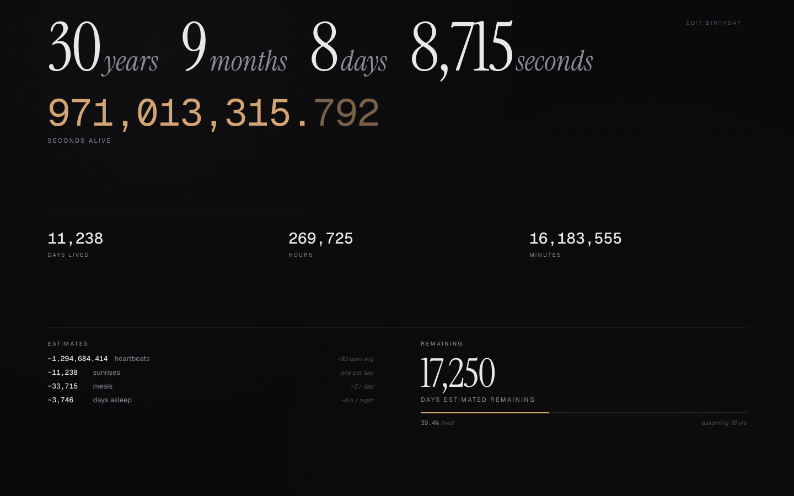

# Life Dashboard

A Chrome new-tab extension that shows how long you've been alive — to the millisecond. Designed to be looked at, not scrolled past.

<!-- Add screenshot.png to the repo root and uncomment: -->
<!--  -->

## Why

A quiet, typographic reminder of finite time on every new tab. Not motivational, not productivity-flavored — just numbers, well set.

Built in an evening. Free. No accounts, no analytics, no data leaves your browser.

## Install

The Chrome Web Store charges $5 to publish, which I didn't pay. So this is **sideload-only**. Install takes about 30 seconds.

1. **Download.** Click the green **Code** button above → **Download ZIP**. Extract it.
   _Or:_ `git clone https://github.com/aashikahmed/life-dashboard.git`
2. **Open `chrome://extensions`** in Chrome.
3. **Toggle "Developer mode"** ON (top-right).
4. Click **"Load unpacked"** → select the `life-dashboard/` folder.
5. **Open a new tab.** First run asks for your birthday + place. Save. Done.

## Configure

Enter your DOB once. The dashboard takes over every new tab from then on.

To change later, click the tiny **EDIT BIRTHDAY** link in the top-right corner of the dashboard. Same panel.

The place-of-birth input auto-detects your timezone for accurate calculation. Dataset covers ~120 major world cities. Anything not in the list falls back to your browser's current timezone — fine for most people.

## Privacy

- Settings stored in `chrome.storage.sync` (Chrome's built-in cross-device sync, scoped to your Google account).
- Nothing sent anywhere. No analytics, no telemetry, no third-party requests apart from fonts (see below).
- The only outbound request is loading Instrument Serif + Geist + Geist Mono from Google Fonts. To go fully offline, self-host the woff2 files — see _Customize_.

## Share with a friend

Send them the GitHub link. Or:

```sh
zip -r life-dashboard.zip life-dashboard/
```

Email/AirDrop the zip. They unzip and follow the install steps. Each person sets their own birthday on first run.

## Customize

Three files. Anyone reading this can change anything.

| File | What's in it |
|---|---|
| `index.html` | Markup + all CSS inline (`<style>` block) |
| `app.js` | Calendar diff, 60fps ticker, settings flow, `CITIES` array (add more cities to expand timezone detection) |
| `manifest.json` | MV3 manifest |

Quick tweaks:
- **Accent color** — edit `--accent` in `index.html`
- **Life expectancy assumption** — edit `LIFE_EXPECTANCY_YEARS` in `app.js`
- **Add more cities** — append to the `CITIES` array in `app.js`
- **Self-host fonts** — download woff2s, drop in `fonts/`, replace the Google Fonts `<link>` with `@font-face` declarations

## Tech

Vanilla HTML/CSS/JS. No build step. Manifest V3. `requestAnimationFrame` for the 60fps seconds ticker. `Intl.DateTimeFormat` for timezone math. `chrome.storage.sync` for settings.

## License

MIT. Do whatever you want with it. If you build something on top, I'd be curious to see it.
